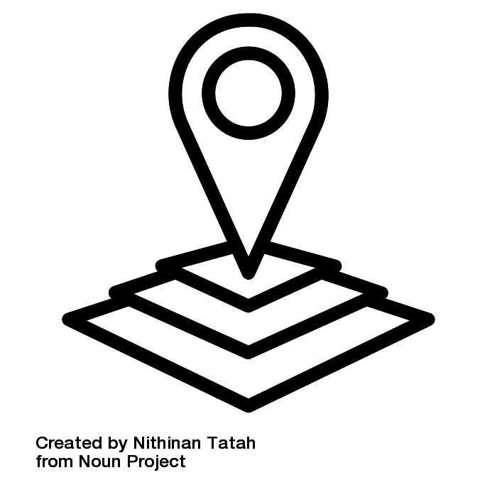

# Our Research

Our lab's mission is to reduce pediatric morbidity and mortality using health services research and multi-center collaboration. Our work spans several key areas:

:::: {.columns}

::: {.column width="60%"}
## Project 1: Geospatial Analysis

Through collaborations with the UConn GIS Health Lab at Connecticut Children's we investigate the impact of place on pediatric health disparities. 
:::

::: {.column width="40%"}
{width=100px}
:::

::::

:::: {.columns}

::: {.column width="60%"}
## Project 2: Low Value Care

Collaborating with Dr. Kimia's NLP tool [DrT](https://documentreviewtools.com/) to investigate predictors of Low Value Care in pediatrics.
:::

::: {.column width="40%"}
{width=100px}
:::

::::

:::: {.columns}

::: {.column width="60%"}
## Project 3: RSV, Bronchiolitis & Nirsevimab

Using PHIS and national datasets, we analyze trends in pediatric respiratory morbidity — with active projects on bronchiolitis geographic clustering, nirsevimab effectiveness (including an MMWR report across 24 states), and the impact of maternal RSV vaccination on pediatric hospitalizations.
:::

::: {.column width="40%"}
{width=100px}
:::

::::

:::: {.columns}

::: {.column width="60%"}
## Project 4: Cannabis Hyperemesis Syndrome (CHS)

We are developing a standardized clinical pathway for CHS management across ED and inpatient settings at Connecticut Children's, paired with a retrospective chart review and multi-center database analysis.
:::

::: {.column width="40%"}
{width=100px}
:::

::::

# Collaborations

We actively collaborate with researchers from:

- [Children's Hospital Assocation/PHIS](https://www.childrenshospitals.org/content/analytics/product-program/pediatric-health-information-system)
- UCONN GIS Lab at CT Children's
- Connecticut Children's COVID Collaborative